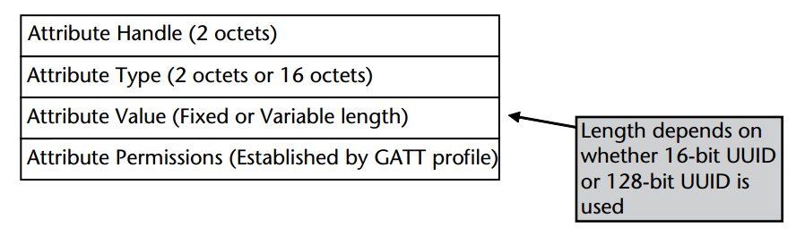
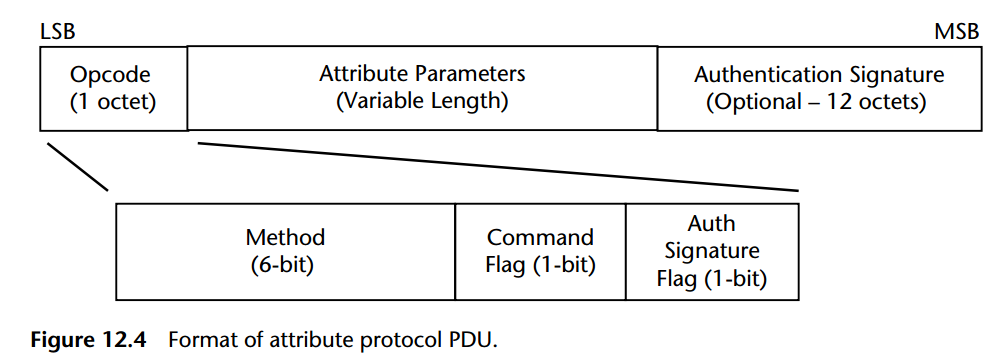
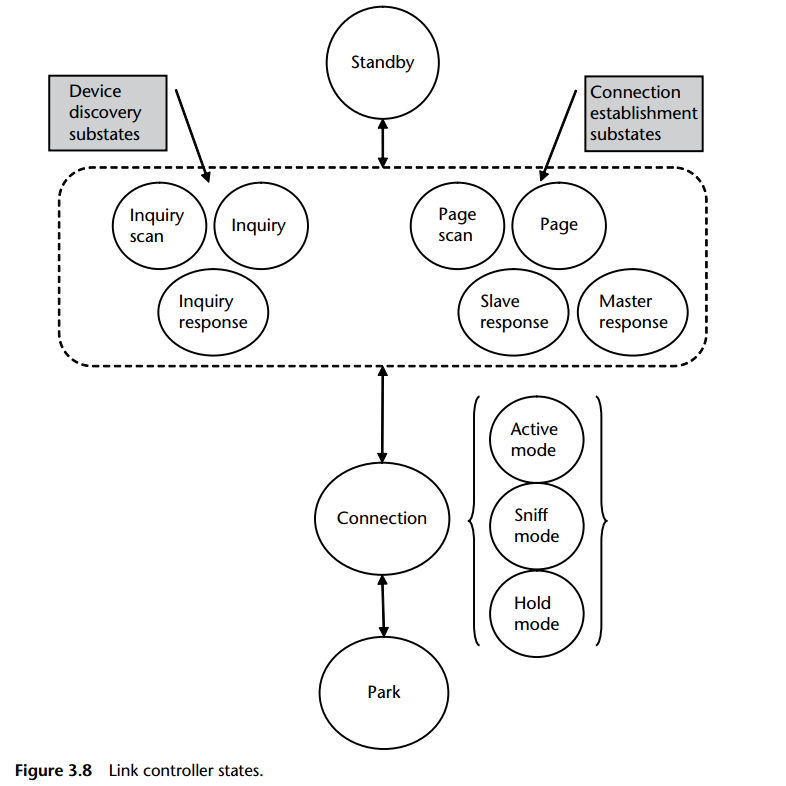

# Inside_ble_2th_梳理

## 12章
### 1. 一个attribute的结构

### 2. 所有pdu分为6类，包格式相同

The length of a variable length field in the PDU is implicitly given by the length of the packet that carries this PDU

## 3章
bluetooth legacy
