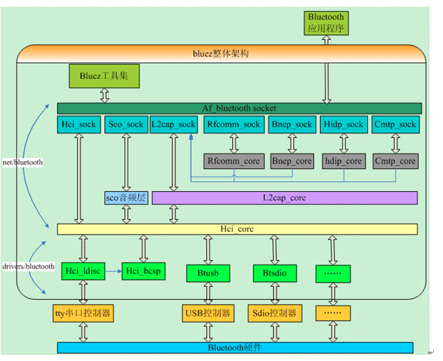

# 蓝牙总结
## 传统蓝牙命令测试
vg710 host 使用bluez协议栈， target 使用的csr8811a12 双模蓝牙芯片
### 启动
```sh
#configure bluetooth
grep -o '&0001 =' /etc/csr8811.psr
[ "$?" != "0"] || {
    in_btaddr=$(bootenv get btaddr | awk -F: '{printf "00%s %s%s 00%s %s%s",$4,$5,$6,$3,$1,$2}')
    echo "// Per intools bt addr info, set it in psr files" >> /etc/csr8811.psr
    echo "&0001 = $in_btaddr" >> /etc/csr8811.psr
}
killall hciattach
bccmd -t bcsp -d /dev/ttyQHS0 -b 115200 psload -r -s 0x0 /etc/csr8811.psr
hciattach -s 115200 /dev/ttyQHS0 bcsp 115200
hciconfig hci0 up
hciconfig hci0 name VG710-`bootenv get serialnumber`
hciconfig hci0 piscan 
```
### 关闭
```sh
hciconfig hci0 down
killall hciattach
```
### rfcomm 测试
1. 使bluez运行在兼容模式
如果bluez版本大于 5， 那么需要时bluetoothd 运行在兼容模式，以支持sdptool等命令行工具。
编辑 /etc/systemd/system/dbus-org.bluez.service 文件, 然后重启服务，如果无法正常重启，可以直接重启系统。
```sh
ExecStart=/usr/lib/bluetooth/bluetoothd -C
ExecStartPost=/usr/bin/sdptool add SP
```
2. 配置rfcomm.conf
```
rfcomm0 {
        bind yes;
        # Replace the device address with the address of your bluetooth serial device
        device 48:5F:99:33:C1:28;
        #channel 1 is VERY IMPORTANT, 当前rfcomm使用的channel
        channel 1;
        comment "Bluetooth Serial";

}
```
4. 一端设备等待连接
```sh
rfcomm watch hci0
```
5. 另一端设备连接
```sh
rfcomm connect hci0 <bdaddr>
```
参考连接[https://www.reddit.com/r/raspberry_pi/comments/6nchaj/guide_how_to_establish_bluetooth_serial/](https://www.reddit.com/r/raspberry_pi/comments/6nchaj/guide_how_to_establish_bluetooth_serial/)


## BLE连接测试
1. 使PC处于advertising状态
设置advertising data并使能advertising
方法1：
```sh
#在Linux PC上开启le adv， 注意vg710总是无法成功设置le adv， 需要后面解决
hciconfig hci0 leadv 0
```
方法2(直接通过hcitool下发raw hci命令)：
```sh
hcitool -i hci0 cmd 0x08 0x0008 12 11 07 9E CA DC 24 0E E5 A9 E0 93 F3 A3 B5 01 00 40 8E 00 00 00 00 00 00 00 00 00 00 00 00 00
hcitool -i hci0 cmd 0x08 0x0006 00 08 00 08 00 00 00 00 00 00 00 00 00 07 00
hcitool -i hci0 cmd 0x08 0x000A 01
```

2. 在VG710上连接PC ble
```sh
gatttool -i hci0 -I -b 48:5F:99:33:C1:28 
#然后进入下面的交互模式
[48:5F:99:33:C1:28][LE]> connect
Attempting to connect to 48:5F:99:33:C1:28
Connection successful    
[48:5F:99:33:C1:28][LE]> primary   # 获取primary service
attr handle: 0x0001, end grp handle: 0x0005 uuid: 00001800-0000-1000-8000-00805f9b34fb  #service 1
attr handle: 0x0006, end grp handle: 0x0009 uuid: 00001801-0000-1000-8000-00805f9b34fb  #service 2
[48:5F:99:33:C1:28][LE]> characteristics 0x0001 0x0005 #获取characteristics
handle: 0x0002, char properties: 0x02, char value handle: 0x0003, uuid: 00002a00-0000-1000-8000-00805f9b34fb
handle: 0x0004, char properties: 0x02, char value handle: 0x0005, uuid: 00002a01-0000-1000-8000-00805f9b34fb
[48:5F:99:33:C1:28][LE]> characteristics 0x0006 0x0009 #获取characteristics
handle: 0x0007, char properties: 0x20, char value handle: 0x0008, uuid: 00002a05-0000-1000-8000-00805f9b34fb
[48:5F:99:33:C1:28][LE]> char
char-desc        char-read-uuid   char-write-req   
char-read-hnd    char-write-cmd   characteristics  
[48:5F:99:33:C1:28][LE]> char-read-hnd 0x0003 #以handle方式获取characteristics的value
Characteristic value/descriptor: 56 6f 73 74 72 6f 33 34 37 30 
[48:5F:99:33:C1:28][LE]> char-read-hnd 0x0005
Characteristic value/descriptor: 04 01 
[48:5F:99:33:C1:28][LE]> char-read-hnd 0x0008 #以handle方式获取characteristics的value
Characteristic value/descriptor:    
[48:5F:99:33:C1:28][LE]> disconnect #断开连接
[48:5F:99:33:C1:28][LE]> quit #退出gatttool
```
测试步骤和命令可参考【Inside Bluetooth Low Energy 2nd Edition】16章

## bluez相关整理
1. bluez整体结构

2. bluez实用工具
- hcitool 
```sh
hcitool -i hci0 scan #legacy bluetooth scan
hcitool -i hci0 lescan #ble scan
hcitool -i hci0 cmd #以二进制的方式直接下指令，具体的可以参考【Inside Bluetooth Low Energy 2nd Edition】9章
```
- hciconfig
```sh
hciconfig -a #展示存在的蓝牙结构机器配置
hciconfig name xxxx # 设置蓝牙名称
```
3. 注意：vg710使用的时bluez5.37, 后面如果要开发的需要明确具体的需求，看dbus接口是否满足需要，对bluez来说，没有现成的gatt C接口可以使用。