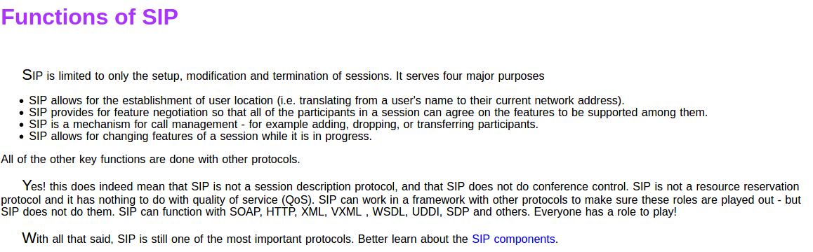
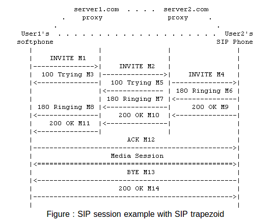

# sip

This 3-way-handshaking (INVITE+OK+ACK) is used for reliable call setup.

VoIP:
What is a VoIP phone?

VoIP means Voice over Internet Protocol. VoIP phones (or Digital Phones) send voice data in packets over the IP layer. The services they provide are typically the same as the normal phones but the underlying network and the technology are different.

It might be a dedicated device (like the traditional handset) using IP connection.
**It can also be a normal phone connected to the network through a telephony adapter (TA).**
Else it can be a softphone.

运营商是否支持电话号码从普通电话网络到VoIP的迁移， 如果支持体验好不好，会不会产生很大的延迟

SDP is the short form of Session Description Protocol. It is used to describe multimedia sessions in a format understood by the participants over a network.

从模拟电话采集的数据如何处理，处理成什么音频的流媒体格式