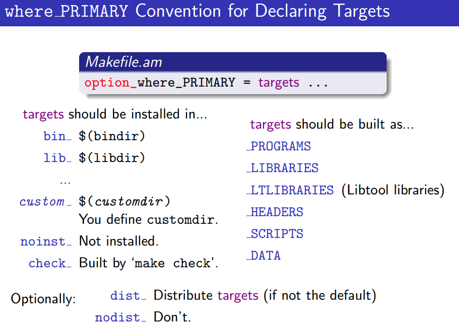
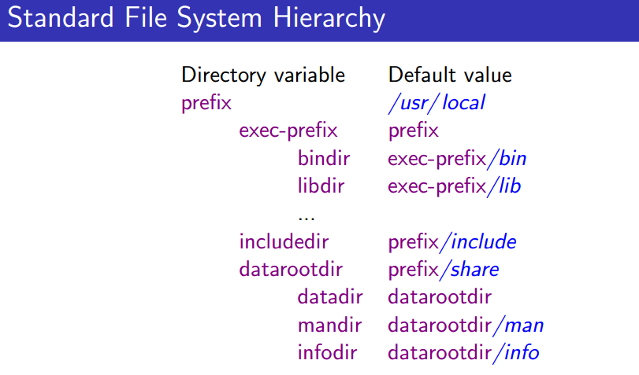
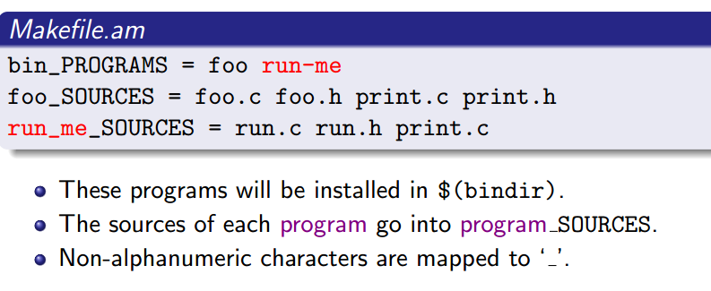
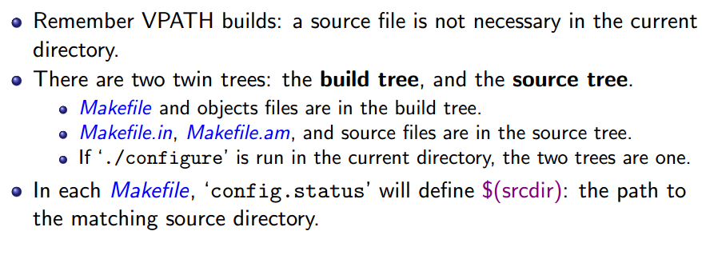
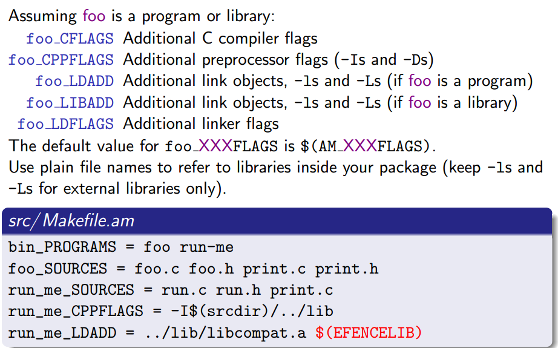

# automake常用语法

## 1. 使用where_PRIMARY 模式来声明目标

## 2. target中非字母数字的字符被转换成 "_"

## 3. build tree 与 source tree
在编译时，你可以mkdir 一个 build 目录然后在里面运行 ../configure, 然后编译生成的文件都会位于build目录下，这个要注意在使用-I添加头文件时要 -I$(srcdir)/dir, 否则是在build tree
路径下查找dir目录

## 4. LDADD 增加链接时的库

LDADD is added when linking all programs.
AM CPPFLAGS contains additional preprocessor flags