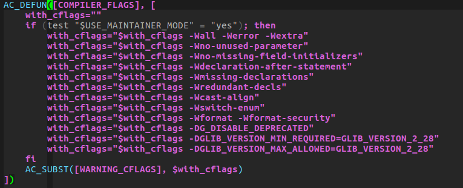
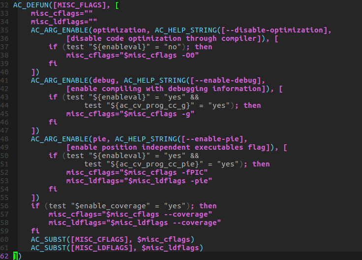

# autools 常用宏

## 1. AC_USE_SYSTEM_EXTENSIONS
    The following macro makes it possible to use features of Posix that are extensions to C, as well as platform extensions not defined by Posix.This macro was introduced in Autoconf 2.60. If possible, enable extensions to C or Posix on hosts that normally disable the extensions, typically due to standards-conformance namespace issues. This should be called before any macros that run the C compiler. The following preprocessor macros are defined where appropriate:

    _GNU_SOURCE
        Enable extensions on GNU/Linux.
    __EXTENSIONS__
        Enable general extensions on Solaris.
    _POSIX_PTHREAD_SEMANTICS
        Enable threading extensions on Solaris.
    _TANDEM_SOURCE
        Enable extensions for the HP NonStop platform.
    _ALL_SOURCE
        Enable extensions for AIX 3, and for Interix.
    _POSIX_SOURCE
        Enable Posix functions for Minix.
    _POSIX_1_SOURCE
        Enable additional Posix functions for Minix.
    _MINIX
        Identify Minix platform. This particular preprocessor macro is obsolescent, and may be removed in a future release of Autoconf. 

## 2. m4_ifdef([AM_SILENT_RULES], [AM_SILENT_RULES([yes])])
m4_ifdef 判断宏是否定义，如果定义执行第二个参数

## 3. AM_SILENT_RULES
使用静默规则
参考连接: [https://autotools.io/automake/silent.html?utm_source=www.flameeyes.eu&utm_medium=url&utm_campaign=vanitydomainssite](https://autotools.io/automake/silent.html?utm_source=www.flameeyes.eu&utm_medium=url&utm_campaign=vanitydomainssite)

## 4. AM_MAINTAINER_MODE
关闭缺省时仅供程序维护者使用的makefile目标，并修改以使configure能理解 –enable-maintainer-mode选项。–enable-maintainer-mode将maintaineronly目标重新打开。仅供维护者使用的makefile目标允许最终用户清除自动生成的文件，比如configure，这意味着要修复编译故障，必须安装有autoconf和automake软件。注意，因为autogen.sh脚本主要是给开发人员用的，autogen.sh会自动传递一个–enable- maintainer-mode选项给configure

## 5. AC_PREFIX_DEFAULT
设置 --prefix 的默认值

## 6. COMPILER_FLAGS
bluez 在acinclude.m4中定义的宏

## 7. PKG_PROG_PKG_CONFIG 
PKG_PROG_PKG_CONFIG to ensure that the pkg-config program is available to your
toolchain, in case the other pkg-config macros are not called

## 8. AC_LANG_C
— Macro: AC_LANG_C
Same as ‘AC_LANG([C])’ (see AC_LANG). 
AC_LANG (language) ： Do compilation tests using the compiler, preprocessor, and fle extensions for the specifed language.

## 9. AC_C_RESTRICT
若restrict关键字用了非标准拼写，把restrict定义为该拼写

## 10. AC_PROG_CC
寻找C编译器以决定CC变量的值

## 11. AC_PROG_CC_PIE
AC_DEFUN([AC_PROG_CC_PIE], [
	AC_CACHE_CHECK([whether ${CC-cc} accepts -fPIE], ac_cv_prog_cc_pie, [
		echo 'void f(){}' > conftest.c
		if test -z "`${CC-cc} -fPIE -pie -c conftest.c 2>&1`"; then
			ac_cv_prog_cc_pie=yes
		else
			ac_cv_prog_cc_pie=no
		fi
		rm -rf conftest*
	])
])

## 12. AM_PROG_CC_C_O
若C编译器不支持同时-c -o选项，则定义NO_MINUS_C_MINUS_O

## 13. AC_PROG_INSTALL
准备install命令.

## 14. AC_PROG_MKDIR_P
准备mkdir -p命令

## 15. m4_define
定义一个m4变量
参考：[http://www.zhangjiee.com/wiki/programming/cpp/autotools.html](http://www.zhangjiee.com/wiki/programming/cpp/autotools.html)

## 16. AC_DISABLE_STATIC
disable 静态库

## 17. AC_PROG_LIBTOOL
检查libtool是否存在

## 18. AC_CHECK_PROG (VARIABLE, PROG-TO-CHECK-FOR, VALUE-IF-FOUND, [VALUE-IF-NOT-FOUND], [PATH = '$PATH'], [REJECT])
按PROG-TO-CHECK-FOR在PATH是否存在把VARIABLE设置为VALUE-IF-FOUND或VALUE-IF-NOT-FOUND

## 19. AC_CHECK_HEADERS(HEADER-FILES, [ACTION-IF-FOUND], [ACTION-IF-NOT-FOUND], [INCLUDES]) 	
按系统头文件能否编译做不同事，定义HAVE_HEADER-FILE为0或1 AC_CHECK_HEADERS_ONCE (HEADER-FILES)

## 20. AM_CONDITIONAL
AM_CONDITIONAL是在configure.ac里面定义一个条件，这样在Makefile.am里面就可以使用这个条件了，如果没有定义，是不可以使用的。
参考：[https://geesun.github.io/posts/2015/02/autotool.html](https://geesun.github.io/posts/2015/02/autotool.html)

## 21. MISC_FLAGS
bluez 定义在acinclude.m4 中

## 22. AC_ARG_ENABLE (FEATURE, HELP-STRING, [ACTION-IF-GIVEN],[ACTION-IF-NOT-GIVEN])
--disable-FEATURE，在用户指定时运行ACTION-IF-GIVEN（可用shell变量enableval获取参数值，没有则yes或no），否则ACTION-IF-NOT-GIVEN
也可以参考：[http://itren.xiaolee.net/p/1154093.html](http://itren.xiaolee.net/p/1154093.html)

## 23. AC_CHECK_FUNC (FUNCTION, [ACTION-IF-FOUND], [ACTION-IF-NOT-FOUND]) 
按C函数是否已声明做不同工作

## 24. AC_CHECK_LIB (LIBRARY, FUNCTION, [ACTION-IF-FOUND], [ACTION-IF-NOT-FOUND], [OTHER-LIBRARIES])
e.g. AC_CHECK_LIB(rt, clock_gettime, dummy=yes, AC_MSG_ERROR(realtime clock support is required)) 
按是否存在库函数做不同事情

## 25. PKG_CHECK_MODULES(prefix, list-of-modules, action-if-found, action-if-not-found)
provides a very basic and easy way to check for the presence of a given package in the system. Nonetheless, there are some caveats that require attention when using the macro

## 26. AC_SUBST (VARIABLE, [VALUE])
AC_SUBST的目的，就是输出变量，使得后面的Makefile.am能用
参考：[https://blog.csdn.net/jackred/article/details/5755527](https://blog.csdn.net/jackred/article/details/5755527)

## 27. AC_DEFINE (VARIABLE, VALUE, [DESCRIPTION])
定义C宏，一般会出现在config.h文件

## 28. AC_ARG_WITH (PACKAGE, HELP-STRING, [ACTION-IF-GIVEN], [ACTION-IF-NOT-GIVEN])
提供一个用户开关选项--with-PACKAGE和--without-PACKAGE，在用户指定时运行ACTION-IF-GIVEN（可用shell变量withval获取参数值，没有则yes或no），否则ACTION-IF-NOT-GIVEN

## 29. AC_MSG_RESULT
打印checking结果并另起新行

## 30. AC_DEFINE_UNQUOTED (VARIABLE, VALUE, [DESCRIPTION])
定义C宏（键值进行shell的变量、反引号和反斜杠替换）， 就是说value可以是shell变量引用

## 31. AC_OUTPUT
e.g. AC_OUTPUT(Makefile src/bluetoothd.8 lib/bluez.pc)
关注其中的参数，请参考：[https://stackoom.com/question/3a83E/%E5%9C%A8AC-OUTPUT-%E7%9A%84%E5%8F%82%E6%95%B0%E4%B8%AD%E4%BD%BF%E7%94%A8PACKAGE-VERSION](https://stackoom.com/question/3a83E/在AC-OUTPUT-的参数中使用PACKAGE-VERSION)

## 32. m4_include([m4/autotools_mythbuster.m4])
The m4_include directive works quite like the #include directive of the C programming language, and simply copies over the content of the file

## 33. AC_CONFIG_MACRO_DIR
指定使用具体目录存放第三方宏，即一些m4宏没在默认搜索路径下，通常是在别的地方把宏拷到具体目录中（比如m4目录）
e.g. AC_CONFIG_AUX_DIR([sntp/libevent/build-aux])
AC_CONFIG_MACRO_DIR([m4])指定使用m4目录存放第三方宏；然后在最外层的Makefile.am中加入ACLOCAL_AMFLAGS = -I m4

## 34. AC_PRESERVE_HELP_ORDER
要求分栏--help格式，要在AC_ARG_ENABLE或AC_ARG_WITH前

## 35. AC_CANONICAL_BUILD
计算构建系统类型变量build，及其三个私有部分build_cpu, build_vendor, build_os。
如果指定了选项--build，那么build是config.sub对build_alias的规范化；否则由shell脚本config.guess指定。
如果使用这些宏，必须将config.guess于config.sub跟源码一起发布

## 36. AC_CANONICAL_HOST
同上

## 37. AC_CANONICAL_TARGET
同上

## 38. AC_CACHE_CHECK